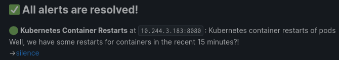

# Rust Webhook Transformer

Rust Webhook Transformer is a Rust-based application built to transform and forward webhook events and is designed to be run in a Docker container, preferably within a Kubernetes cluster. This application provides an efficient and customizable solution for processing and delivering webhook payloads to different endpoints.

## Features

Transform and forward webhook events from different formats:

| Source | Destination | Notes |
| ------ | ----------- | ----- |
| [Grafana](https://grafana.com/) | [Hookshot](https://github.com/matrix-org/matrix-hookshot) | Supports both raw `message` forwarding, as well as a custom, more compact, representation of the alerts. Here is a sample:  |
| [UptimeKuma](https://github.com/louislam/uptime-kuma) (`application/json`) | [Hookshot](https://github.com/matrix-org/matrix-hookshot) | Supports both raw `msg` forwarding, as well as a custom, representation of the alerts. Here is a sample:  |

## Configuration

The configuration of the Webhook Transformer can be done through the `config.yaml` file. It allows you to define webhook sources and destinations, customize transformation rules, and more. See the `config.sample.yaml` file for an example configuration.

## Contributing

Contributions to the Webhook Transformer project are welcome! If you encounter any issues, have feature requests, or would like to contribute code, please go ahead!

## Acknowledgments

The Webhook Transformer project was inspired by the need for a flexible and scalable solution to transform and forward Grafana webhook events.